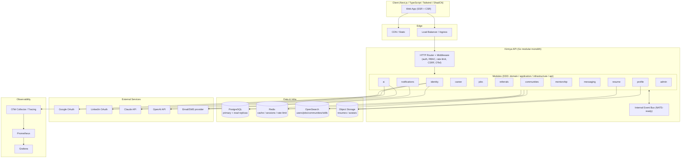

# Kirmya — System Architecture

> Status: Draft v1 · Last updated: 2026-06-14

## 1. Architecture Style

**Modular monolith** with **Clean Architecture / DDD** boundaries, deployed as a single Go binary in MVP, designed for later extraction into independent services. Each module owns its data and exposes behavior through **interfaces only** — no module imports another module's internal packages. Cross-module communication goes through (a) published interfaces or (b) the **internal event bus** (NATS-ready).

Why modular monolith first: one deployable, one transaction boundary where it helps, fast iteration — while keeping seams clean enough to extract Identity/Jobs/Messaging/AI/Community into services when scale demands.

## 2. High-Level Architecture Diagram



## 3. Module Boundaries & Communication

- Each module = a bounded context with its own domain model and persistence.
- A module exposes a **public interface** (e.g. `identity.Service`) consumed via dependency injection. No reaching into another module's `domain`/`infrastructure`.
- **Synchronous** cross-module needs use the published interface (e.g. `jobs` asks `identity` to resolve a user).
- **Asynchronous / decoupled** flows use **domain events** on the event bus (see §6). Example: `ResumeUploaded` → `career` recomputes skill gap; `ai` triggers a review.
- Shared kernel kept minimal: IDs, error types, pagination, auth context (`internal/common`).

## 4. Layering (per module — Clean Architecture / DDD)

```
<module>/
  domain/          # entities, value objects, domain events, repository interfaces (no deps on infra)
  application/     # use cases / command+query handlers (CQRS-ready), orchestrates domain + ports
  infrastructure/  # repository impls (Postgres), external clients, event publishers (adapters)
  api/             # HTTP handlers, DTOs, request validation, route registration
```

Dependency rule points inward: `api → application → domain`; `infrastructure` implements `domain` ports. Domain has zero outward dependencies.

> Migration note: the existing modules use `domain/dto/handler/repository/routes/service`. New modules adopt the layout above; existing modules are migrated incrementally (`service`→`application`, `repository`+clients→`infrastructure`, `handler`+`routes`→`api`, `dto`→`api/dto`).

## 5. CQRS Readiness

Application layer separates **commands** (mutations, return ids/acks) from **queries** (reads, may bypass domain and hit read-optimized stores like OpenSearch/Redis). MVP keeps a single Postgres store; the command/query split in the application layer lets us add read models later without touching domain logic.

## 6. Event-Driven Design

Domain events published to an in-process **event bus** with a `Publisher`/`Subscriber` interface. Swappable for NATS JetStream later without changing publishers/subscribers.

Core events:
```
UserRegistered, EmailVerified,
ResumeUploaded, ResumeParsed, SkillGapDetected,
ReferralRequested, ReferralAccepted, ReferralDeclined,
JobPosted, JobApplied,
MentorshipBooked, MentorshipCompleted,
MessageSent, NotificationCreated
```
Each event is an immutable struct with `EventID`, `OccurredAt`, `AggregateID`, payload. The bus guarantees at-least-once in-process delivery (NATS later for cross-service + durability).

## 7. Cross-Cutting Concerns (middleware pipeline)

Request → `RequestID/Trace` → `Recover` → `SecurityHeaders` → `CORS` → `RateLimit (Redis)` → `CSRF` → `Auth (JWT)` → `RBAC` → handler. Audit logging wraps state-changing handlers. All emit OTel spans.

## 8. Caching Strategy (Redis)

- Profiles, jobs, search results, recommendations: cache-aside with TTL + event-driven invalidation (e.g. `ProfileUpdated` busts profile cache).
- Sessions / refresh-token denylist, rate-limit counters, MFA challenge state.

## 9. Search (OpenSearch)

Indexes for users, jobs, communities, skills, companies. Writes mirrored from Postgres via domain events (outbox-style). Supports autocomplete (edge n-grams), fuzzy match, and filtered queries.

## 10. Scalability & Extraction Path

- Stateless API → scale horizontally behind LB; sticky-less (JWT + Redis).
- Postgres primary + read replicas; partition/shard high-volume tables (messages) later.
- 100M messages: messaging module designed for extraction to a dedicated service + its own store/queue.
- Extraction order when needed: **Identity → Messaging → AI → Jobs → Community**. Because modules talk via interfaces + events, extraction = swap in-process call for RPC + swap in-process bus for NATS; business logic unchanged.

## 11. Technology Summary

| Concern | Choice |
|---|---|
| Language / runtime | Go 1.26 |
| HTTP | std-lib `net/http` ServeMux + custom middleware |
| DB | PostgreSQL (primary + replicas) |
| Cache | Redis |
| Search | OpenSearch |
| Events | in-process bus → NATS JetStream |
| Object storage | S3-compatible |
| AI | Claude (primary), OpenAI (secondary) |
| Frontend | Next.js + TypeScript + Tailwind + ShadCN |
| Auth | JWT + refresh rotation, OAuth (Google/LinkedIn), TOTP MFA |
| Observability | OpenTelemetry + Prometheus + Grafana |
| Packaging | Docker, Docker Compose, K8s + Helm |
| CI/CD | GitHub Actions |
