# Kirmya — Database Design (PostgreSQL)

> Status: Draft v1 · Last updated: 2026-06-14
> Engine: PostgreSQL 16. Conventions below apply to every table.

## 1. Conventions

- **Primary keys:** `uuid` (`gen_random_uuid()` via `pgcrypto`). Avoids cross-shard collisions and hides row counts.
- **Audit fields (every table):** `created_at timestamptz not null default now()`, `updated_at timestamptz not null default now()`, `created_by uuid null`, `updated_by uuid null`.
- **Soft delete:** `deleted_at timestamptz null`. Active rows = `deleted_at is null` (partial indexes used). Hard delete only via admin/erasure flows.
- **Optimistic locking:** `version integer not null default 1`; updates do `... WHERE id=$ AND version=$old` then bump `version`.
- **Transactions:** multi-row writes wrapped in a tx; outbox rows written in the same tx for event/search consistency.
- **Enums:** modeled as Postgres `text` + `CHECK` (cheaper to evolve than native enums) or lookup tables for large sets.
- **Naming:** `snake_case`, plural tables.

## 2. ERD (core MVP)

```mermaid
erDiagram
  USERS ||--o| USER_PROFILES : has
  USERS ||--o{ USER_ROLES : grants
  ROLES ||--o{ USER_ROLES : assigned
  USERS ||--o{ OAUTH_ACCOUNTS : links
  USERS ||--o{ REFRESH_TOKENS : owns
  USERS ||--o{ MFA_CREDENTIALS : secures
  USERS ||--o{ AUDIT_LOGS : actor

  USER_PROFILES ||--o{ WORK_EXPERIENCES : lists
  USER_PROFILES ||--o{ EDUCATIONS : lists
  USER_PROFILES ||--o{ CERTIFICATIONS : lists
  USER_PROFILES ||--o{ PROFILE_SKILLS : has
  SKILLS ||--o{ PROFILE_SKILLS : referenced

  USERS ||--o{ RESUMES : uploads
  RESUMES ||--o{ RESUME_VERSIONS : versions
  RESUME_VERSIONS ||--o| RESUME_SCORES : scored

  USERS ||--o{ SKILL_GAP_ANALYSES : receives
  SKILL_GAP_ANALYSES ||--o{ LEARNING_RECOMMENDATIONS : suggests

  COMPANIES ||--o{ JOBS : posts
  USERS ||--o{ JOBS : posted_by_recruiter
  JOBS ||--o{ JOB_APPLICATIONS : receives
  USERS ||--o{ JOB_APPLICATIONS : submits
  JOBS ||--o{ SAVED_JOBS : saved
  JOBS ||--o{ JOB_SKILLS : requires
  SKILLS ||--o{ JOB_SKILLS : referenced

  USERS ||--o{ REFERRAL_REQUESTS : requests
  USERS ||--o{ REFERRAL_REQUESTS : reviews_as_referrer
  JOBS ||--o{ REFERRAL_REQUESTS : targets

  COMMUNITIES ||--o{ COMMUNITY_MEMBERS : has
  USERS ||--o{ COMMUNITY_MEMBERS : joins
  COMMUNITIES ||--o{ POSTS : contains
  POSTS ||--o{ COMMENTS : has
  POSTS ||--o{ REACTIONS : has
  POSTS ||--o| POLLS : may_have

  USERS ||--o{ MENTOR_PROFILES : is
  MENTOR_PROFILES ||--o{ MENTORSHIP_SESSIONS : offers
  USERS ||--o{ MENTORSHIP_SESSIONS : books
  MENTORSHIP_SESSIONS ||--o| MENTORSHIP_REVIEWS : rated

  CONVERSATIONS ||--o{ CONVERSATION_PARTICIPANTS : has
  USERS ||--o{ CONVERSATION_PARTICIPANTS : member
  CONVERSATIONS ||--o{ MESSAGES : contains
  MESSAGES ||--o{ MESSAGE_RECEIPTS : tracked

  USERS ||--o{ NOTIFICATIONS : receives
  EVENT_OUTBOX }o--|| USERS : "—"
```



## 3. Module → Table Map

| Module | Tables |
|---|---|
| identity | `users`, `roles`, `user_roles`, `oauth_accounts`, `refresh_tokens`, `mfa_credentials`, `email_verification_tokens`, `password_reset_tokens`, `audit_logs` |
| profile | `user_profiles`, `work_experiences`, `educations`, `certifications`, `profile_skills`, `skills`, `languages`, `profile_languages`, `portfolio_links` |
| resume | `resumes`, `resume_versions`, `resume_scores` |
| career | `skill_gap_analyses`, `learning_recommendations`, `career_path_suggestions`, `salary_insights` |
| jobs | `companies`, `jobs`, `job_skills`, `job_applications`, `saved_jobs` |
| referrals | `referral_requests`, `referral_outcomes` |
| communities | `communities`, `community_members`, `posts`, `comments`, `reactions`, `polls`, `poll_options`, `poll_votes`, `post_tags` |
| mentorship | `mentor_profiles`, `mentorship_sessions`, `mentorship_reviews`, `mentor_resources` |
| messaging | `conversations`, `conversation_participants`, `messages`, `message_receipts`, `attachments` |
| notifications | `notifications` |
| ai | `ai_interactions` (prompt/response log, cost), `resume_reviews`, `coach_threads`, `coach_messages` |
| platform | `event_outbox` (transactional outbox for events + search indexing) |

## 4. Key Table Definitions (identity — built first)

```sql
-- extensions
CREATE EXTENSION IF NOT EXISTS pgcrypto;

CREATE TABLE users (
    id              uuid PRIMARY KEY DEFAULT gen_random_uuid(),
    email           citext NOT NULL,
    password_hash   text,                 -- null for OAuth-only accounts (Argon2id)
    email_verified  boolean NOT NULL DEFAULT false,
    status          text NOT NULL DEFAULT 'active'
                      CHECK (status IN ('active','suspended','deactivated')),
    mfa_enabled     boolean NOT NULL DEFAULT false,
    last_login_at   timestamptz,
    created_at      timestamptz NOT NULL DEFAULT now(),
    updated_at      timestamptz NOT NULL DEFAULT now(),
    created_by      uuid,
    updated_by      uuid,
    deleted_at      timestamptz,
    version         integer NOT NULL DEFAULT 1
);
CREATE UNIQUE INDEX uq_users_email_active ON users (email) WHERE deleted_at IS NULL;

CREATE TABLE roles (
    id    uuid PRIMARY KEY DEFAULT gen_random_uuid(),
    name  text NOT NULL UNIQUE        -- job_seeker, referrer, mentor, recruiter, admin
);

CREATE TABLE user_roles (
    user_id uuid NOT NULL REFERENCES users(id) ON DELETE CASCADE,
    role_id uuid NOT NULL REFERENCES roles(id) ON DELETE CASCADE,
    granted_at timestamptz NOT NULL DEFAULT now(),
    PRIMARY KEY (user_id, role_id)
);

CREATE TABLE oauth_accounts (
    id            uuid PRIMARY KEY DEFAULT gen_random_uuid(),
    user_id       uuid NOT NULL REFERENCES users(id) ON DELETE CASCADE,
    provider      text NOT NULL CHECK (provider IN ('google','linkedin')),
    provider_uid  text NOT NULL,
    created_at    timestamptz NOT NULL DEFAULT now(),
    UNIQUE (provider, provider_uid)
);

CREATE TABLE refresh_tokens (
    id            uuid PRIMARY KEY DEFAULT gen_random_uuid(),
    user_id       uuid NOT NULL REFERENCES users(id) ON DELETE CASCADE,
    token_hash    text NOT NULL,            -- store hash, never raw token
    family_id     uuid NOT NULL,            -- rotation family for reuse detection
    expires_at    timestamptz NOT NULL,
    revoked_at    timestamptz,
    replaced_by   uuid,
    created_at    timestamptz NOT NULL DEFAULT now(),
    user_agent    text,
    ip            inet
);
CREATE INDEX idx_refresh_tokens_user ON refresh_tokens(user_id) WHERE revoked_at IS NULL;

CREATE TABLE mfa_credentials (
    id          uuid PRIMARY KEY DEFAULT gen_random_uuid(),
    user_id     uuid NOT NULL REFERENCES users(id) ON DELETE CASCADE,
    type        text NOT NULL DEFAULT 'totp' CHECK (type IN ('totp')),
    secret_enc  text NOT NULL,              -- encrypted TOTP secret
    confirmed_at timestamptz,
    created_at  timestamptz NOT NULL DEFAULT now()
);

CREATE TABLE email_verification_tokens (
    id          uuid PRIMARY KEY DEFAULT gen_random_uuid(),
    user_id     uuid NOT NULL REFERENCES users(id) ON DELETE CASCADE,
    token_hash  text NOT NULL,
    expires_at  timestamptz NOT NULL,
    used_at     timestamptz,
    created_at  timestamptz NOT NULL DEFAULT now()
);

CREATE TABLE password_reset_tokens (
    id          uuid PRIMARY KEY DEFAULT gen_random_uuid(),
    user_id     uuid NOT NULL REFERENCES users(id) ON DELETE CASCADE,
    token_hash  text NOT NULL,
    expires_at  timestamptz NOT NULL,
    used_at     timestamptz,
    created_at  timestamptz NOT NULL DEFAULT now()
);

CREATE TABLE audit_logs (
    id          uuid PRIMARY KEY DEFAULT gen_random_uuid(),
    actor_id    uuid,                       -- null = system
    action      text NOT NULL,              -- e.g. 'user.login', 'referral.accept'
    target_type text,
    target_id   uuid,
    metadata    jsonb NOT NULL DEFAULT '{}',
    ip          inet,
    created_at  timestamptz NOT NULL DEFAULT now()
);
CREATE INDEX idx_audit_actor_time ON audit_logs(actor_id, created_at DESC);

-- transactional outbox (events + search indexing)
CREATE TABLE event_outbox (
    id            bigserial PRIMARY KEY,
    aggregate_id  uuid NOT NULL,
    event_type    text NOT NULL,
    payload       jsonb NOT NULL,
    occurred_at   timestamptz NOT NULL DEFAULT now(),
    published_at  timestamptz
);
CREATE INDEX idx_outbox_unpublished ON event_outbox(id) WHERE published_at IS NULL;
```

## 5. Referrals — state machine

`referral_requests.status`: `requested → under_review → accepted | declined`; on accepted, an application may be created and the outcome tracked: `application_submitted → interviewing → offer → hired | rejected | withdrawn`.

```sql
CREATE TABLE referral_requests (
    id            uuid PRIMARY KEY DEFAULT gen_random_uuid(),
    seeker_id     uuid NOT NULL REFERENCES users(id),
    referrer_id   uuid REFERENCES users(id),   -- nullable until claimed
    job_id        uuid REFERENCES jobs(id),
    company_id    uuid REFERENCES companies(id),
    message       text,
    status        text NOT NULL DEFAULT 'requested'
                    CHECK (status IN ('requested','under_review','accepted','declined')),
    created_at    timestamptz NOT NULL DEFAULT now(),
    updated_at    timestamptz NOT NULL DEFAULT now(),
    deleted_at    timestamptz,
    version       integer NOT NULL DEFAULT 1
);
```

## 6. Migrations

Migrations live in `backend/migrations/` as ordered, idempotent SQL (`NNN_description.up.sql` / `.down.sql`). Existing MySQL migrations (001–004) are replaced by PostgreSQL equivalents. The runner is `internal/platform/migrations.go`.

Planned order:
```
001_extensions_and_users
002_roles_and_user_roles
003_oauth_refresh_mfa_tokens
004_audit_and_outbox
005_profiles_and_skills
006_resumes
007_companies_and_jobs
008_referrals
009_communities
010_mentorship
011_messaging
012_notifications
013_career_intelligence
014_ai
```

## 7. Seed Data

`backend/migrations/seed/` (or `make seed`): roles (`job_seeker, referrer, mentor, recruiter, admin`), starter skills taxonomy, default communities (Facilities Management, Construction, Logistics, Technology, HR, Operations), a few demo companies + jobs, and demo users per role for local dev.

## 8. Indexing & Performance Notes
- Partial unique index on active email (above).
- GIN indexes on `jsonb` (`audit_logs.metadata`) and on search-relevant text via OpenSearch (not Postgres FTS in MVP, except autocomplete fallback).
- Composite indexes on hot query paths: `job_applications(user_id, status)`, `notifications(user_id, read_at)`, `messages(conversation_id, created_at)`.
- High-volume tables (`messages`, `notifications`, `audit_logs`) are partition-ready (range by month) for later.
